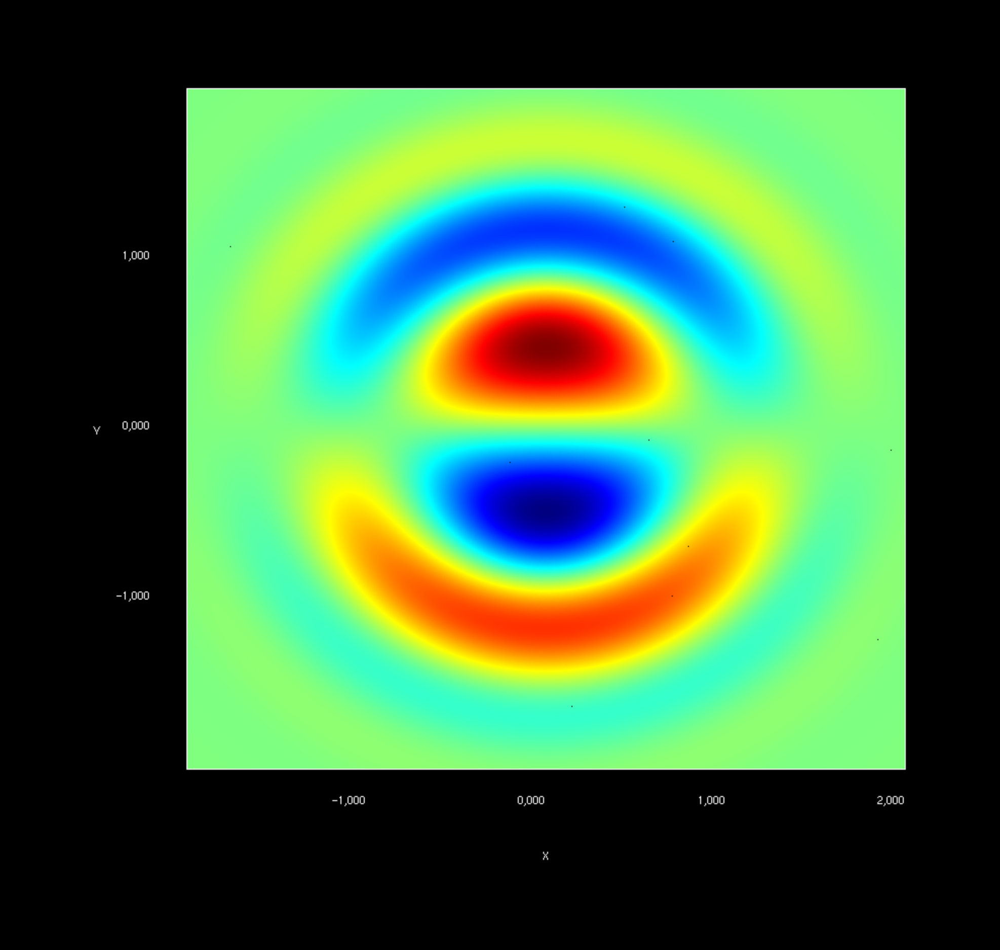
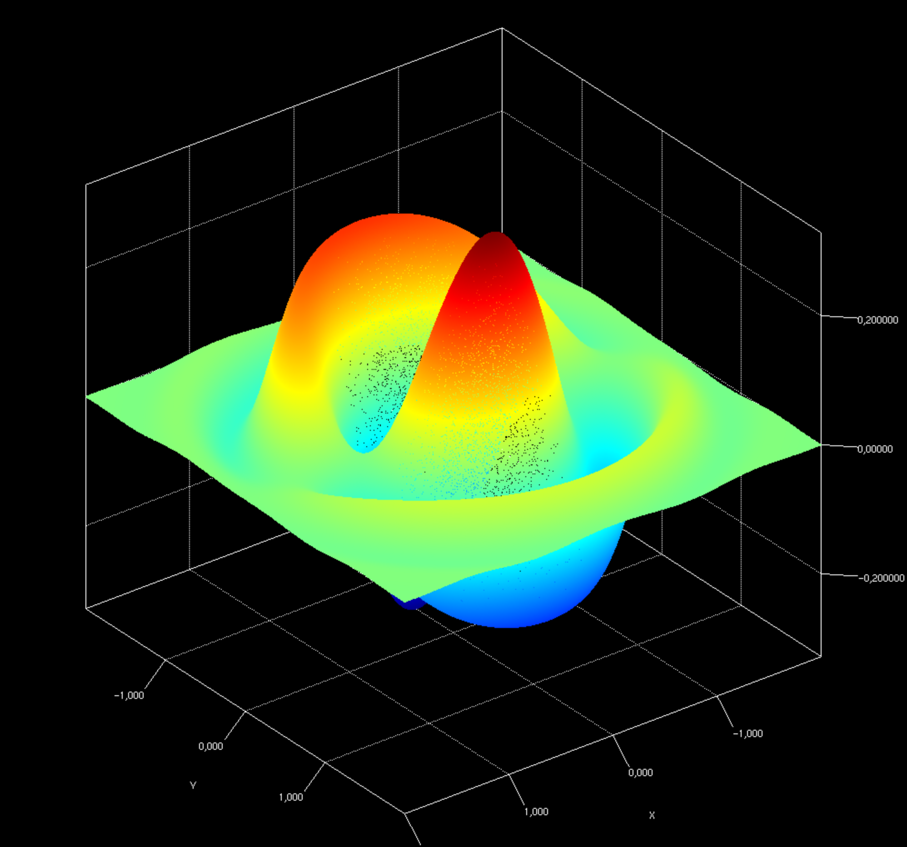
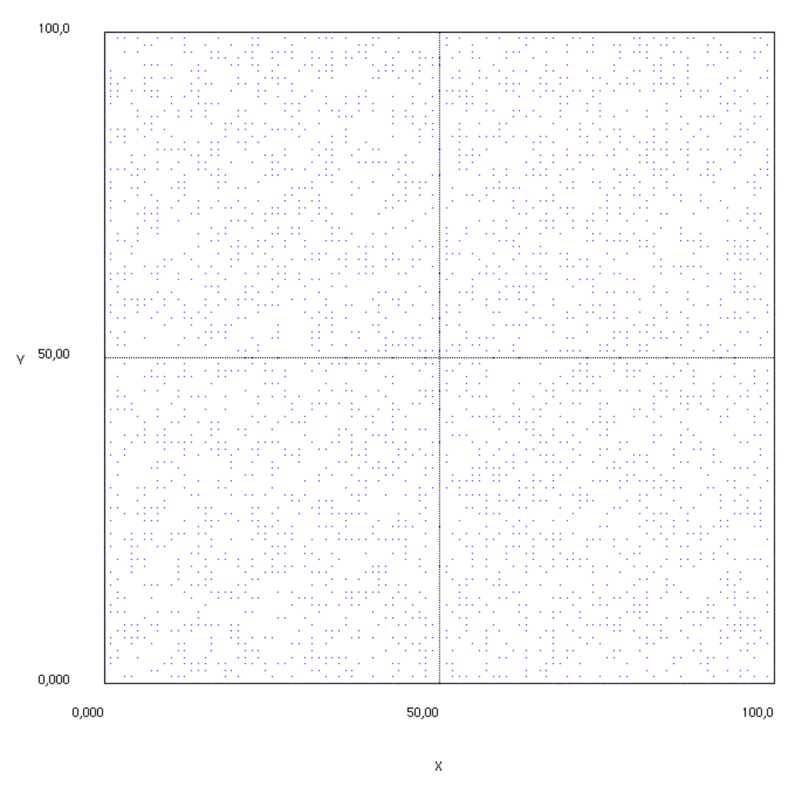
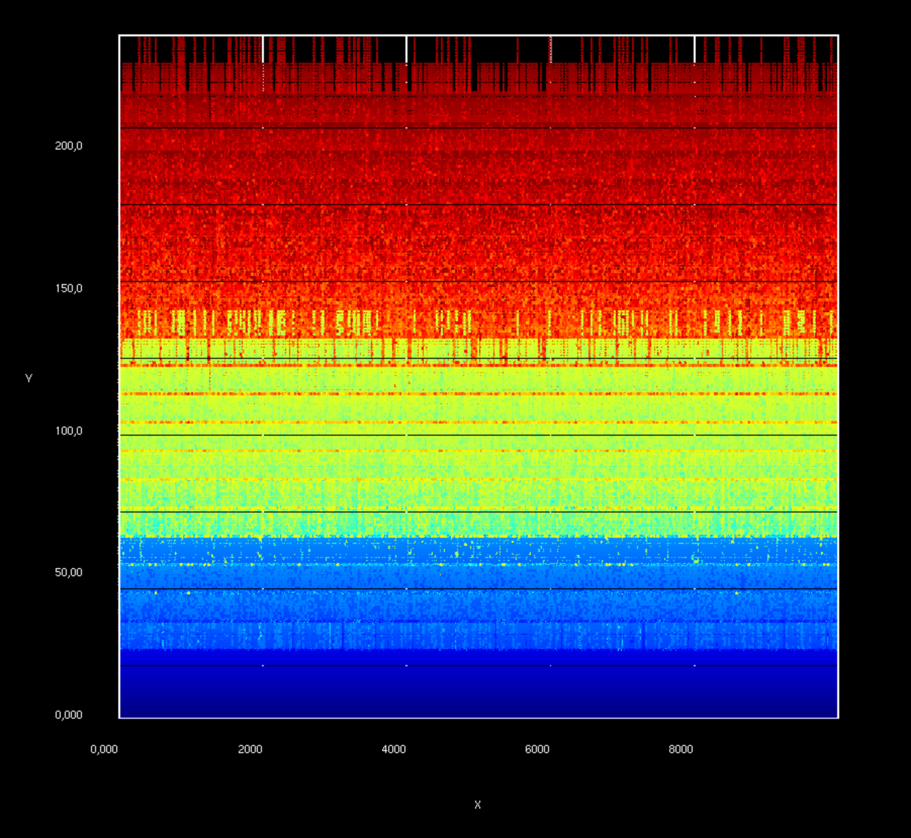
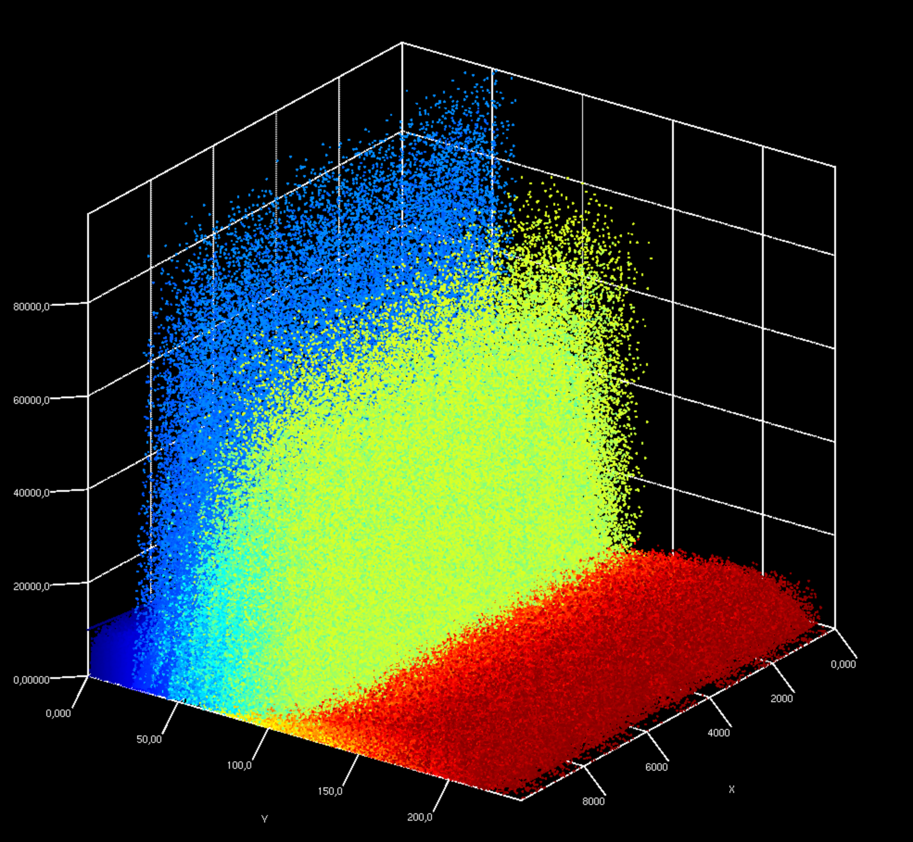

# BigPicture
Drawing BigData Charts

The aim of this library is to provide connectors to big data tools (Spark, Hive, etc) to easily render large scatters, lines, surfaces in 2d or 3d charts relying on OpenGL rendering.

Jzy3d, based on JOGL, enables Java applications to use OpenGL to make best usage of computer's GPU capabilities (speed, memory).

## Demos

See demos in package <a href="https://github.com/jzy3d/jzy3d-bigviz/blob/master/src/test/java/org/jzy3d/demos/">org.jzy3d.demos</a>


### 5 milions points scatter plot

Generate 5.000.000 points, setup a colormap, and build a VBO (GPU in-memory) scatter plots rendering smoothly in an AWT window.

VBO allow to store the geometry once in GPU and then to trigger rendering on demand (viewpoint change, frame repaint, etc)


```java
public class DemoScatterVBO {
    public static int MILION = 1000000;
    public static float ratio = 5f;

    public static void main(String[] args) {
        int size = (int) (ratio * MILION);

        List<Coord3d> coords = ScatterGenerator.getScatter(size);
        ColorMapper coloring = ScatterGenerator.coloring(coords);
        ScatterVBO scatter = new ScatterVBO(new ListCoord3dVBOLoader(coords, coloring));
        chart(scatter);
    }

    public static Chart chart(ScatterVBO scatter) {
        Chart chart = AWTChartComponentFactory.chart(Quality.Intermediate, "awt");
        chart.getScene().getGraph().add(scatter);
        chart.getView().setBackgroundColor(Color.BLACK);
        chart.getAxeLayout().setMainColor(Color.WHITE);
        chart.getView().getCamera().setViewportMode(ViewportMode.STRETCH_TO_FILL);
        chart.addMouseController();
        chart.open("VBO Scatter demo", 1000, 1000);
        layout2d(chart);
        return chart;
    }

    public static void layout2d(Chart chart) {
        View view = chart.getView();
        view.setViewPositionMode(ViewPositionMode.TOP);
        view.getCamera().setViewportMode(ViewportMode.STRETCH_TO_FILL);

        IAxeLayout axe = chart.getAxeLayout();
        axe.setZAxeLabelDisplayed(false);
        axe.setTickLineDisplayed(false);
    }
}
```


#### 2D view


#### 3D view


### Spark chart for a JavaFX application

Create a Spark ```JavaRDD``` containing ```Coord3d``` given by a CSV file, and show a 2D scatter plot with a uniform color in a JavaFX application.

Note : This application makes use of a simple 2D scatter plot implementation not using VBO (see 5 milions points scatter plot).


```java
public class DemoSparkCsvFileJavaFXChart extends Application{
    public static void main(String[] args) {
        Application.launch(DemoSparkCsvFileJavaFXChart.class);
    }

    @Override
    public void start(Stage stage) throws Exception {
        stage.setTitle("Spark | Jzy3d | JavaFX");
        stage.setWidth(800);
        stage.setHeight(800);

        new SparkRDDChartBuilderJavaFX(){
            @Override
            public void loadDataAndBuildScene() {
                layout2d();

                JavaRDD<Coord3d> coordinates = SparkChartIO.csv3d("data/random/random-4000.csv");
                makeScatterSerie2d(coordinates);
            }
        }.onStart(stage); // run actual data loading and chart generation
    }
}
```




### HBase table content overview

Create an AWT application scanning and drawing an HBase table. 

* Each row is represented is assigned a X value.
* Each column of a row is represented by a colored point along the Y axis. The same unique color is assigned to all row columns having the same name. Points are stacked to build an histogram of the number of column, but each column could have a unique Y value rather than a color. Color could thus be free to represent another information (e.g. number of versions for the value)
* Each column value of a row is represented by the Z value of the point
* VBO allow to store the geometry once in GPU and then to trigger rendering on demand (viewpoint change, frame repaint, etc)


```java
public class DemoHBaseTableScanPlotAWT {
    public static void main(String[] args) throws Exception {
        // read from HBase table
        HBaseIO hbase = new HBaseIO();
        List<List<KeyVal<String, Float>>> rows = hbase.scanRows(DemoHBaseTableGenerate.TABLE);

        // draw data
        DrawableVBO drawable2 = new DrawableVBO(new VBOBuilderTableColumnsScatter3d(rows));
        BigPicture.chart(drawable2, BigPicture.Type.ddd).black();
    }
}
```


#### 2D view



#### 3D view



## Run yourself

```
git clone git@github.com:jzy3d/bigpicture.git
cd bigpicture
mvn install
```

Join our <a href="https://groups.google.com/forum/#!forum/jzy3d">discussion group here</a>, and share your improvements of this library!
